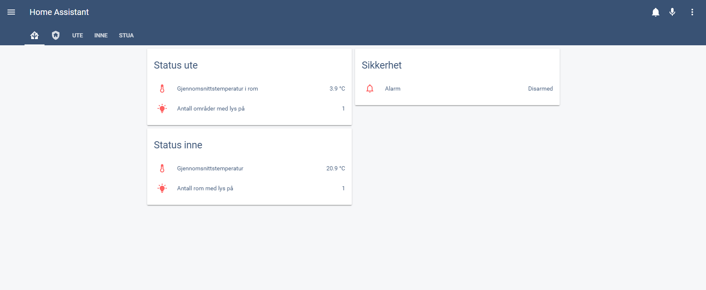

# Home assistant

### Forside

### Oversikt over områder ute

### Oversikt over rom inne

### Stemning
Kortet for soverommet og stua er satt opp med vertical-stack. Øvre del inneholder
et customoppsett for valg av scener/stemning.

 

Et annet eksempel på scene/stemningskort

#### Flyt på scenevalg/scenevalg
1. Entity på kort er en switch
2. Switch trigger en automatisering
3. Automatiseringen har to funksjoner
   1. Et sett med input-booleans oppdateres slik at ikonene på kortet markeres riktig
   2. Skrur på valgt scene/stemning
4. Scene endrer lysene 

### System
Støtter home-assistant [v0.90.2](https://github.com/home-assistant/home-assistant/releases/tag/0.90.2)